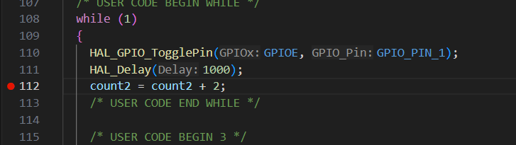

## STM32 Nucleo-H755ZI 2-Blink Debug Example

This repo is an example of how to setup dual-core debugging using the [Cortex Debug](https://github.com/Marus/cortex-debug) VSCode Extension. These instructions were particularly made for the STM32 Nucleo-H755ZI development boards.

## Setup:

There are two ways you can set this up:
- #### With STM32CubeIDE
    - No extra setup required, but you might need to [configure the Cortex Debug settings](https://github.com/Marus/cortex-debug/wiki#vscode-settings-for-cortex-debug) to point to the right bin locations. 
- #### Without STM32CubeIDE
    - Requires: 
        - [ARM GNU Toolchain](https://developer.arm.com/downloads/-/arm-gnu-toolchain-downloads)
            - You can either use MinGW64 installer only if you are on Windows(You must have MinGW64) or download and extract/tar the zip/archive for all platforms
        - [STM32CubeProgrammer (Requires ST account to download)](https://www.st.com/en/development-tools/stm32cubeprog.html)
        - ST-Link GDB Server
            - Note: This is NOT the ST-LINK server software module on the ST website
    - After downloading the required toolchains, [set up](https://github.com/Marus/cortex-debug/blob/master/debug_attributes.md) your [Cortex Debug extension settings](https://github.com/Marus/cortex-debug/wiki#vscode-settings-for-cortex-debug) to point to the right /bin locations. 

I referenced this issue here to set up my launch.json
https://github.com/Marus/cortex-debug/issues/1008

## How to Use:

These steps were done on Windows 11 with STM32CubeIDE. When you have all the dependencies and Cortex Debug settings configured, this is how you would use it:

1. To begin, place some breakpoints down.

    

2. Plug in STM32 Nucleo-H755ZI board
3. Select Run and Debug or press Ctrl+Shift+D

    

> Important: You must start the CM7 debug ***BEFORE*** the CM4
4. At the Run and Debug drop-down menu at the top left , select **Debug CM7 - ST-Link** and click the green play button to **Start Debugging**. Wait until **Debug CM7** in the **Call Stack** menu on the left says **PAUSED ON BREAKPOINT** before continuing.

    

5. At that same drop-down menu, select **Attach CM4 - ST-Link** and click the green play button to **Start Debugging**. Wait until **Attach CM4** in the **Call Stack** menu on the left says **PAUSED ON ATTACH** before continuing.

    

6. In the **Call Stack** menu, you can see **Debug CM7** would be **PAUSED ON BREAKPOINT** and **Attach CM4** would be **PAUSED ON ATTACH**. 

    

    For **Debug CM7**, click on **Continue**.

    

7. By now, you should see **Debug CM7** **RUNNING**. 

    
    
    Click on **Continue** for **Attach CM4**. 

    
    
    Both profiles should now be **PAUSED ON BREAKPOINT**.

    

8. On the Nucleo board, you should be able to see both Green and Yellow LEDs on. 
    
    

    In the **Call Stack** menu, you should now be able to toggle both LEDs by clicking **Continue** for whichever specified profile you want. The CM7 controls the Green LED and the CM4 controls the Yellow LED. 

    I have also set global variables count and count2 for the CM7 and CM4 cores respectively to monitor.

    

    You can use this menu to switch between watching the CM7 and CM4 variables 

    

9. To end the session, you can stop both of the debugging sessions. I recommend to **Disconnect** the CM4 before you **Stop** the CM7.

    >Note: You cannot stop the CM7 and debug the CM4 by itself, the CM4 requires the CM7 in order to function. 

    You can **Disconnect** the CM4 and debug the CM7 by itself

    
    
    

    

